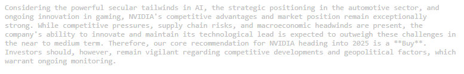
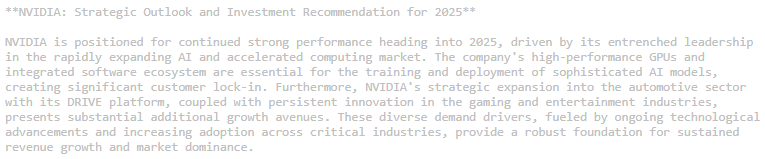
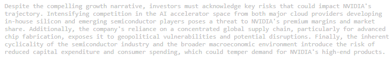

# 🤖 Autonomous Financial Research Agent

## 📌 Project Overview
This repository features an **Autonomous Multi-Agent System** that automates end-to-end financial market research. Built with the **CrewAI** framework and **Gemini 2.0 Flash**, the system deploys a "crew" of specialized AI agents that collaborate to analyze stock trends, identify risks, and generate investor-ready reports.

### **The Agentic Advantage**
Unlike standard LLM prompts, this system utilizes **Agentic Workflows**. The agents operate in a feedback loop: they research, evaluate data quality, and then synthesize a final report. This multi-step reasoning allows for significantly higher accuracy and professional depth.

---

## 🛠️ Tech Stack
* **Framework:** CrewAI
* **Model:** Google Gemini 2.0 Flash
* **Language:** Python 3.10+
* **Environment Management:** `python-dotenv` for secure API key handling.

---

## 🛠️ System Architecture
The system divides labor between two distinct AI personas:

1.  **Senior Financial Researcher:** Tasked with identifying market drivers (e.g., AI compute demand, automotive expansion) and evaluating competitive risks.
2.  **Technical Financial Writer:** Tasked with transforming raw research data into a polished, structured investment summary.

---

## 📊 Live Execution Results: NVIDIA (Case Study)
The system was tested with a real-world scenario researching **NVIDIA**. The agents successfully identified:

* **Growth Drivers:** Dominance in AI/Accelerated Computing (Blackwell architecture), expansion in the Automotive sector (DRIVE platform), and sustained innovation in Gaming (RTX/DLSS).
* **Market Risks:** Intensifying competition from hyperscalers (custom silicon), supply chain vulnerabilities (TSMC reliance), and semiconductor industry cyclicality.

### **Investment Thesis Archetypes**
The agent is capable of generating different outlooks based on the data retrieved. Below are the three primary archetypes produced by the agent:

| BUY Recommendation | HOLD Recommendation | SELL Recommendation |
| :--- | :--- | :--- |
|  |  |  |

---

## 🧠 Key Technical Highlights
* **Multi-Agent Orchestration:** Managed complex state and task delegation between multiple agents using CrewAI.
* **Variable Injection:** Implemented dynamic `{company}` placeholders, allowing the system to scale across different target stocks without code changes.
* **Sequential Logic:** Designed a dependent pipeline where the Writer agent only begins after the Researcher provides a validated data payload.

---

## 🚀 Installation & Usage
1.  **Clone the Repo:**
    ```bash
    git clone https://github.com/Rahilshah01/autonomous-financial-research-agent.git
    ```
2.  **Install Dependencies:**
    ```bash
    pip install crewai google-genai python-dotenv
    ```
3.  **Setup Environment:**
    Create a `.env` file and add: `GEMINI_API_KEY=your_api_key_here`
4.  **Run the Crew:**
    ```bash
    python main.py
    ```
---
