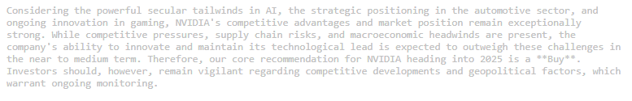
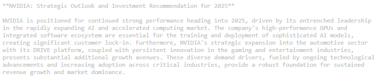
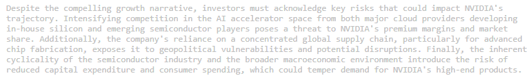

# 🤖 Autonomous Financial Research Agent

<div align="center">


**A fully autonomous multi-agent system that conducts end-to-end financial market research — from raw company name to investor-ready report — with zero human intervention.**

</div>

---

## ⚡ Results at a Glance

| Metric | Detail |
|---|---|
| 🤖 Agents | 2 specialized (Senior Financial Researcher + Technical Financial Writer) |
| 🔄 Orchestration | `Process.sequential` — Writer is blocked until Researcher completes |
| 🎯 LLM | `gemini/gemini-2.5-flash-lite` via CrewAI's LLM wrapper |
| ⚙️ Dynamic Input | Single `{company}` variable — swap any ticker, no code changes |
| 📝 Output | 3-paragraph investor-ready Markdown report with BUY/HOLD/SELL thesis |
| 🧪 Test Case | NVIDIA — growth drivers, risk factors, and recommendation generated autonomously |

---

## 🧠 Why Multi-Agent Over a Single Prompt?

A single LLM prompt produces shallow, generic financial summaries. This system separates **research** from **writing** into two distinct agent personas — each with its own role, goal, and backstory. The quality difference is significant:

```
Single Prompt:       "Analyze NVIDIA" → Generic 2-paragraph summary

This System:         Researcher Agent  → Identifies 3 growth drivers + 3 risks
                           ↓ (sequential handoff — writer waits for validated output)
                     Writer Agent      → Transforms research into structured
                                         investor-grade Markdown report
```

Role specialization plus sequential enforcement means the Writer never hallucinates research it hasn't received.

---

## 🏗️ Agent Architecture

```python
# Agent 1: Researcher
researcher = Agent(
    role='Senior Financial Researcher',
    goal='Uncover deep insights into {company} and its 2025 market outlook.',
    backstory="World-class financial analyst specializing in emerging market trends.",
    llm=gemini_flash
)

# Agent 2: Writer
writer = Agent(
    role='Technical Financial Writer',
    goal='Synthesize research findings into a clear, investor-ready report.',
    backstory="Seasoned business journalist transforming raw data into executive narratives.",
    llm=gemini_flash
)

# Sequential crew — researcher must finish before writer starts
fin_crew = Crew(
    agents=[researcher, writer],
    tasks=[research_task, writing_task],
    process=Process.sequential
)
```

---

## 🛠️ Tech Stack

| Layer | Technology |
|---|---|
| Multi-Agent Framework | CrewAI (`Agent`, `Task`, `Crew`, `Process`) |
| LLM | `gemini/gemini-2.5-flash-lite` (via CrewAI `LLM` wrapper) |
| Orchestration Pattern | `Process.sequential` — strict task dependency enforcement |
| Environment | `python-dotenv` for secure API key management |
| Language | Python 3.10+ |

---

## 📊 Live Execution: NVIDIA Case Study

**Input:** `fin_crew.kickoff(inputs={'company': 'NVIDIA'})`

The Researcher agent autonomously identified:

**Growth Drivers identified:**
- AI/Accelerated Computing dominance (Blackwell GPU architecture)
- Automotive sector expansion (NVIDIA DRIVE platform)
- Sustained gaming ecosystem revenue (RTX/DLSS)

**Risk Factors identified:**
- Hyperscaler custom silicon competition (Google TPU, AWS Trainium)
- TSMC supply chain concentration risk
- Semiconductor industry cyclicality

**Writer output:** A polished 3-paragraph Markdown investment summary with a BUY/HOLD/SELL recommendation — formatted for executive stakeholders.

| BUY Scenario | HOLD Scenario | SELL Scenario |
|---|---|---|
|  |  |  |

---

## 🔑 Key Engineering Decisions

- **Why `Process.sequential`?** The Writer agent must receive validated research before drafting. Sequential enforcement prevents the Writer from generating fabricated analysis — a critical guardrail in financial contexts.
- **Why role + backstory per agent?** CrewAI agents perform significantly better with a defined persona. The "world-class analyst" backstory steers the Researcher toward structured, data-driven output; the "journalist" backstory pushes the Writer toward narrative clarity.
- **Why `{company}` variable injection?** One-line change to `kickoff(inputs={'company': '...'})` re-targets the entire pipeline to any publicly traded company — no prompt editing, no code changes.

---

## 🚀 Quick Start

```bash
# 1. Clone
git clone https://github.com/Rahilshah01/autonomous-financial-research-agent.git
cd autonomous-financial-research-agent

# 2. Install
pip install crewai python-dotenv

# 3. Set API key
echo "GEMINI_API_KEY=your_key_here" > .env

# 4. Run (change company in kickoff inputs if desired)
python main.py
```

---

## 📁 Repository Structure

```
autonomous-financial-research-agent/
├── main.py          # Agents, tasks, crew definition + kickoff
├── images/          # Sample output screenshots (buy/hold/sell)
├── .env.example
├── requirements.txt
└── README.md
```

---

*Built by [Rahil Shah](https://rahil-shah-portfolio.vercel.app/) · MS Data Science @ Stevens Institute of Technology*
